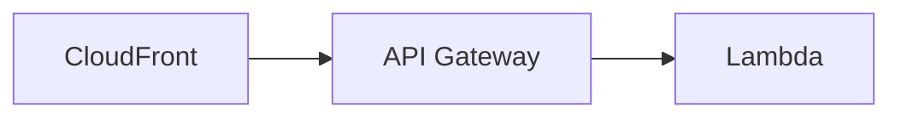

## 概要
Goのアプリケーションからヘッドレスブラウザ([github.com/chromedp/chromedp](https://github.com/chromedp/chromedp))を動かしてWebページのスクリーンショットを取得し、その画像をCDN (CloudFront) で配信するシステムです。<br>
AWS CDK を利用してインフラ構築できるようになっています。

#### インフラ構成


- **Lambda**: 画像生成処理、スクリーンショットの取得、対象Webページの用意など、バックエンドで実行される各種処理を行います。<br>このリポジトリの`app`以下がGoのアプリケーションとなっており、これをコンテナ化してLambdaで実行しています。
- **API Gateway**: HTTP リクエストを受け付けLambdaへルーティングします。
- **CloudFront**: リクエストに対してキャッシュされた画像を配信し、キャッシュが存在しない場合はリクエストをAPI Gateway に転送しレスポンスの画像を配信します。

#### 用途
SNSのOGP画像など、動的な画像生成が求められる場面で活用できます。<br>
画像配信用URLのクエリパラメータを変更し、metaタグに設定するだけで、コンテンツごとに異なるOGP画像を簡単に用意することが可能です。

#### 参考
ヘッドレスブラウザでWebページをスクリーンショットして画像を用意する仕組みは、[github.com/vercel/og-image](https://github.com/vercel/og-image) を参考にしています。


## ドキュメント
以下のURLで画像へアクセスすることができます。デフォルトでは2種類を用意しています。<br>(カスタマイズしたい場合は、`app/internal/router/router.go` を変更)
- **https://[CloudFrontのドメイン]/v1/image/card**
- **https://[CloudFrontのドメイン]/v1/image/web-card**

### GET /v1/image/card
サーバ内でホスティングしてるWebページのスクリーンショット画像を返す <br>

#### クエリパラメータ
|パラメータ|型|説明|必須|備考|
|----|----|----|---|---|
|title|string|大きいテキストを表示|no||
|message|string|小さいテキストを表示|no||

#### Example
`https://[CloudFrontのドメイン]/v1/image/card?title=Goとchromedpを使用してAWS上でOGP画像配信システムを構築してみた&message=hoge`


#### 補足: 画像のデザイン変更について
app/static以下のhtml,cssを編集してLambdaへデプロイすることで、画像のデザインを変更することができます。


### GET /v1/image/web-card
外部Webページへリクエストを送りそのスクリーンショット画像を返す

#### クエリパラメータ
|パラメータ|型|説明|必須|備考|
|----|----|----|---|---|
|url|string|スクリーンショット対象のWebページのURL|yes||
|selector|string|スクリーンショット対象のセレクタ|yes|例: div.screenshot-target|
|width|int|画像の横の長さ|no||
|height|int|画像の縦の長さ|no||

## Quick Start
#### 前提
- **AWS CLI**: AWS CLIがインストールされ、認証情報（aws configure など）が設定されている必要があります。※インストール方法や設定方法については[AWS CLIの公式ドキュメント](https://docs.aws.amazon.com/ja_jp/cli/latest/userguide/getting-started-install.html)などを参照してください。

- **AWS CDK**: CDK CLIのインストールが必要です。※インストール方法や設定方法については[AWS CDKの公式ドキュメント](https://docs.aws.amazon.com/ja_jp/cdk/v2/guide/getting_started.html)などを参照してください。

### 1: Lambda用Dockerイメージの準備

#### パターン1: 自身のアカウントのECRへpushしたイメージを使用する場合
(詳細はTODO)
`app/Makefile` を参考にして、DockerイメージのビルドとECRへのpushを行います。

#### パターン2: PublicRegistryにアップロードされているイメージを使用する場合
Lambda用Dockerイメージとして、筆者がECRのPublicRegistryにアップロードした以下のイメージを利用することもできます。<br>
この場合はイメージのビルドやECRへのpushは不要になります。

- https://gallery.ecr.aws/a4a4z6p8/d-img-gen-demo


### 2: 環境変数の設定

`cdk/.env` ファイルに以下のように環境変数を設定してください。各項目には、適切な値を入力してください。
```cdk/.env
ECR_REGISTRY_NAME=YOUR-ECR-REGISTRY-NAME
ECR_REPOSITORY_NAME=YOUR-ECR-REPOSITORY-NAME
CDK_STACK_ID=YOUR-STACK-ID
```
※注: 各変数の値は、ご利用の AWS 環境およびプロジェクト設定に合わせて変更してください。

`ECR_REPOSITORY_NAME`で指定するDockerイメージは、app以下のアプリケーションをビルドしたものである必要があります。<br>


※ **「パターン2: PublicRegistryにアップロードされているイメージを使用する場合」** は、以下の cdk/.env をそのまま使用することがきます
```cdk/.env
ECR_REGISTRY_NAME=public.ecr.aws/a4a4z6p8
ECR_REPOSITORY_NAME=d-img-gen-demo
CDK_STACK_ID=DImgGenStack
```

### 3: cdkを使ってデプロイする
```
cd cdk
```
```
cdk deploy
```